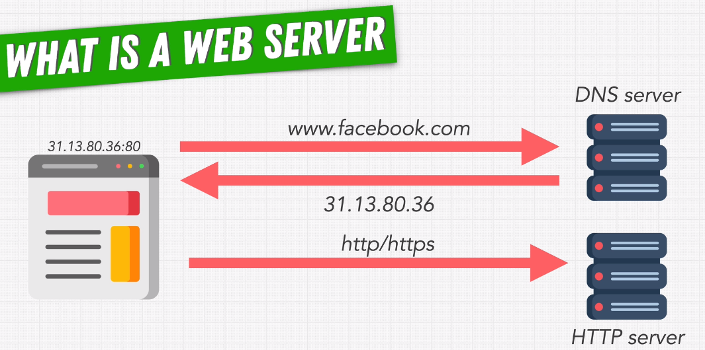
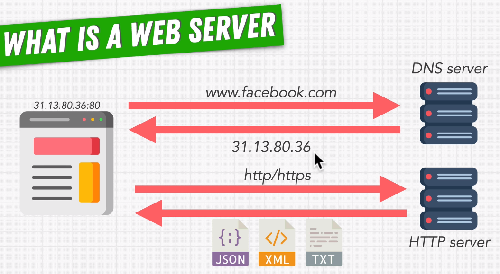

# Web Servers with Node.js

1. What is a web server?

    - DNS(Domain Name System) server

    - IP (Internate Protocol) Addresses

    - This IP address is what the DNS server sends back to our computer. It's usually a set of four numbers between zero and 255, which are separated by periods. It's this IP address that we then use to communicate with the server, which will give us the data that we're asking for.
    
    - It's an HTTP server because we communicate with it using this HTP protocol.
    The Hypertext Transfer Protocol or the secure version of that which encrypts our communication so that no one can snoop on or steal our data.

    -  The way that we specify which type of server with which application we're talking to is by adding to our IP address
    this ports number, which comes after the call and character.
    The port or port number specifies which application on that server should handle our requests.

